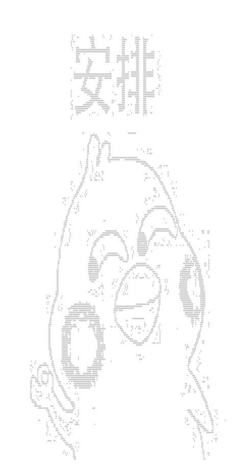

# image2charSet
using opencv transform image to char set
## usage
```
docker buil . -t ${yourTag}
docker run -d \
  -p ${yourPort}: 3000 \
  --name=${yourname} \
  ${yourTag}
```
Browser open `index.html`
## example
- source picture

- output


> have fun